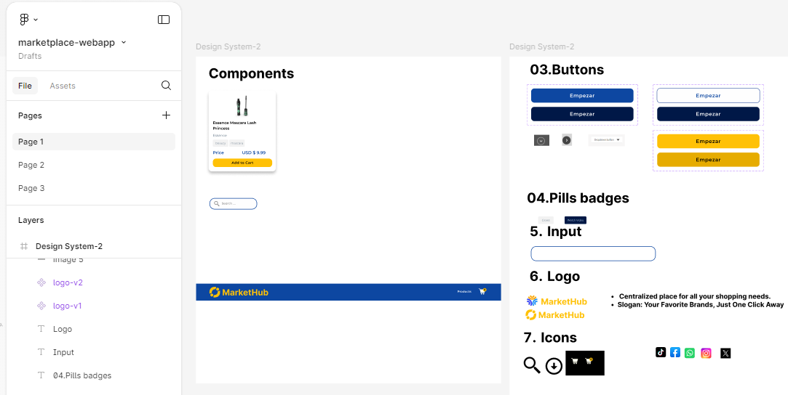
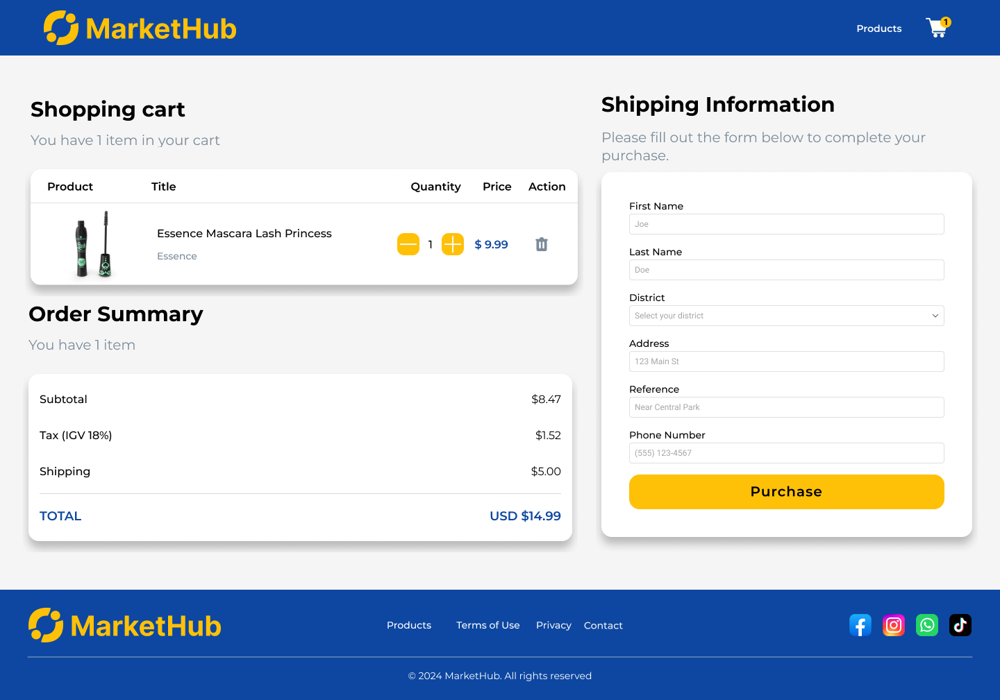

# Market Project

## Descripción

Este proyecto es un mini marketplace implementado con **TypeScript**, **Vite** y **React**. Los usuarios pueden buscar productos, filtrar por categoría y agregar productos a un carrito de compras. Además, se utilizó la API pública de [DummyJSON](https://dummyjson.com/docs/products#products-all) para obtener los productos y categorías.

## Funcionalidades

- **Carga dinámica de productos**: Los productos se cargan desde DummyJSON y se muestran en la página.
- **Búsqueda**: Los usuarios pueden buscar productos utilizando una caja de búsqueda, filtrando automáticamente los resultados a medida que escriben.
- **Filtrado por categorías**: Permite a los usuarios filtrar la lista de productos según la categoría seleccionada.
- **Contador de carrito**: Incrementa el contador de productos en el carrito cada vez que se hace clic en "Add to Cart".
- **Consumo de servicios web**: Utiliza la API Fetch para obtener datos, empleando `async` y `await` para manejar las solicitudes de manera eficiente.
- **Sin uso de bibliotecas externas**: El proyecto está diseñado sin librerías de terceros, utilizando solo código nativo de JavaScript y TypeScript.
- **Configuraciones de calidad de código**: Se han añadido configuraciones de Prettier y ESLint para garantizar consistencia en el estilo y detectar errores, además de alias para optimizar las rutas de importación.
- **Página de Resumen del Carrito**: Se ha creado una nueva página llamada **cart**, donde los usuarios pueden:
  - Visualizar la lista de productos agregados al carrito.
  - Eliminar, agregar o reducir la cantidad de elementos en el carrito.
  - Mostrar la imagen en miniatura del producto, nombre, precio, cantidad con controles de incremento y decremento, y un botón para eliminar.
  - Actualizar el total a pagar en la parte inferior de la tabla.
  - Los botones de incremento y decremento modificarán la cantidad especificada y actualizarán el ícono del carrito.
  - El botón eliminar eliminará el producto de la tabla y actualizará el contador del ícono del carrito.
  - El precio total se actualizará en base a la cantidad de productos en la tabla.

## Migración a React + TypeScript + Vite

Este proyecto ha sido migrado de JavaScript a **React** y **TypeScript**, siguiendo los siguientes lineamientos:

- **Uso de hooks**: Se han utilizado `useEffect` y `useState` correctamente para manejar el estado y los efectos secundarios en los componentes.
- **Arquitectura de carpetas escalable**: La estructura del proyecto está organizada en carpetas que separan los assets, servicios,dominio,mappers, los componentes, las páginas y los utilitarios, asegurando la escalabilidad y mantenibilidad del código.
- **Tipos fuertes**: Se han definido interfaces y tipos para garantizar que los datos se manejen correctamente en toda la aplicación, evitando el uso de `any`.
- **Estructura de Archivos**: La lógica de negocio se ha separado de las definiciones de estructuras de datos, organizando el código en carpetas como `assets`,`components`,`domain`,`utilities`, `services`, y `mappers`.
- **Patrón de Mappers**: Se implementó un patrón de mappers para transformar las respuestas de los servicios en objetos de tipo `Product` y `Category`, lo que facilita la manipulación de datos en la aplicación.

## Estructura del Proyecto

La arquitectura del proyecto está organizada de la siguiente manera, garantizando una clara separación de responsabilidades:

```
/BC56-FRONTEND-REACT-NTTDATA
  ├── /public
  │   ├── vite.svg
  │   └── index.html
  ├── /src
  │   ├── /assets                  # Carpeta para recursos estáticos como imágenes y fuentes.
  │   │   ├── /design
  │   │   ├── /fonts
  │   │   ├── /icons
  │   │   ├── /images
  │   │   └── /vectors
  │   ├── /components              # Carpeta para los componentes que sigue la metodología de atomic design.
  │   │   ├── /atoms
  │   │   ├── /molecules
  │   │   └── /organisms
  │   ├── /contexts                # Manejo de contextos globales.
  │   │   └── CartContext.tsx
  │   ├── /data                    # Datos estáticos y definiciones.
  │   │   ├── districts-data.d.ts
  │   │   └── districts-data.js
  │   ├── /domain                  # Contiene la lógica de negocio y las definiciones de datos.
  │   │   ├── /constants
  │   │   └── /interfaces
  │   ├── /helpers                 # Funciones que incorporan lógica de negocio.
  │   │   └── filter-products.helpers.ts
  │   ├── /mappers                 # Carpeta para la lógica de mapeo de datos que facilita la manipulación de datos.
  │   │   ├── category.mapper.ts
  │   │   └── product.mapper.ts
  │   ├── /pages                   # Contiene las páginas.
  │   │   ├── Cart
  │   │   ├── Home
  │   │   ├── Login
  │   │   └── Products
  │   │       └── ProductsRoutes.tsx
  │   ├── /services                # Maneja llamadas a la API y gestiona el almacenamiento local (localStorage).
  │   │   ├── category.service.ts
  │   │   ├── local-storage.service.ts
  │   │   └── product.service.ts
  │   ├── /store                   # Manejo del estado del carrito.
  │   │   ├── cartActions.ts
  │   │   └── cartReducer.ts
  │   ├── /utils                   # Funciones puras que son sin estado y no dependen de ningún estado externo.
  │   │   └── validation.utils.ts
  │   ├── App.tsx                  # Componente raíz.
  │   ├── index.css                # Estilos de entrada.
  │   ├── main.tsx                 # Archivo de entrada principal de la aplicación.
  │   ├── vite-env.d.ts            # Definiciones de tipos para Vite.
  │   └── react-env.d.ts           # Definiciones de tipos para React.
  ├── .gitignore                   # Archivo para ignorar archivos y carpetas en Git.
  ├── .prettierrc.json             # Configuración para Prettier.
  ├── README.md                    # Documentación del proyecto.
  ├── eslint.config.js             # Configuración para ESLint.
  ├── package.json                 # Archivo de configuración de dependencias del proyecto.
  ├── tsconfig.app.json            # Configuración de TypeScript para la aplicación.
  ├── tsconfig.json                # Configuración general de TypeScript.
  ├── tsconfig.node.json           # Configuración de TypeScript para el entorno Node.js.
  └── vite.config.ts               # Configuración de Vite para la aplicación.


```
**NOTAS :**
- Se ha mantenido la organización de carpetas según las funciones de cada una, facilitando la escalabilidad y mantenibilidad del proyecto.
- La carpeta helpers ahora incluye funciones que implementan la lógica de negocio, mientras que utils contiene funciones puras y stateless.
- La carpeta contexts se ha añadido para manejar el contexto global, específicamente para el carrito.

## Prototipo

Se desarrolló un prototipo de alta fidelidad utilizando la herramienta Figma en donde se ha agregado la página . En este proceso, se implementaron conceptos de Atomic Design para estructurar los elementos de la página de manera eficiente y coherente.





### Página Resumen

Se ha agregado una nueva página, la cual permite visualizar la lista de productos agregados al carrito, dándole la opción al usuario de poder eliminar, agregar o reducir productos. Por otro lado, la página tiene un formulario sobre la información de envío, para el proceso de compra.También, se tiene la página en el caso de que no se ha agregado ningún producto.




**LINK:** [Ver prototipo de alta fidelidad en Figma](https://www.figma.com/proto/TMCcAkrrzbQA4suediBIO3/marketplace-webapp?node-id=2-14&node-type=frame&t=dXskumLnmc50er9v-0&scaling=min-zoom&content-scaling=fixed&page-id=2%3A2)

## Implementación del Proyecto

A continuación se muestran capturas de la implemenación:

