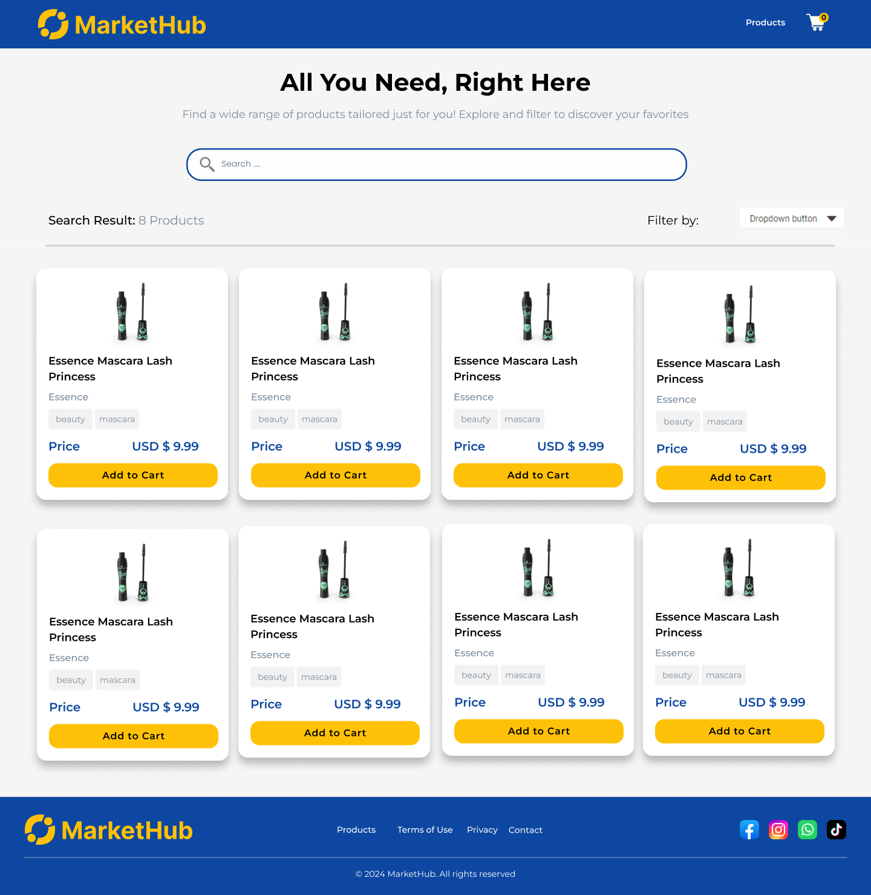
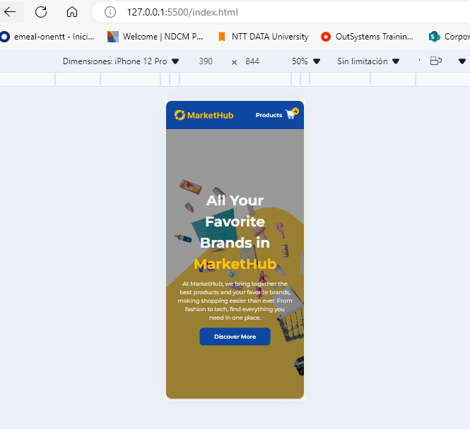
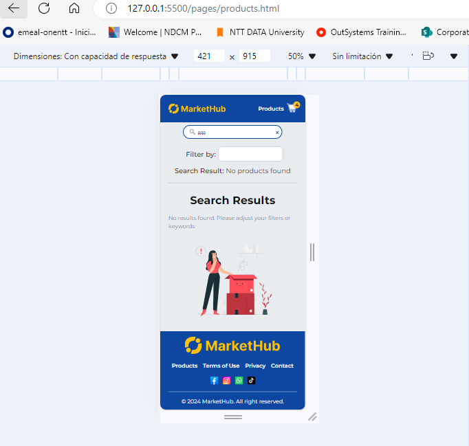

# Proyecto de Market place con JavaScript

Este proyecto es un mini market place implementado con Vanilla JavaScript. Los usuarios pueden buscar productos, filtrar por categoría y agregar productos a un carrito de compras.Además, se utilizó la API pública de DummyJSON para obtener los productos y categorías.

## Funcionalidades

- **Carga dinámica de productos**: Los productos se cargan desde [DummyJSON](https://dummyjson.com/docs/products#products-all) y se muestran en la página.
- **Búsqueda**: Los usuarios pueden buscar productos utilizando una caja de búsqueda. Los productos se filtran automáticamente a medida que el usuario escribe.
- **Filtrado por categorías**: Se puede filtrar la lista de productos según la categoría seleccionada por el usuario.
- **Contador de carrito**: El contador de productos en el carrito se incrementa cada vez que el usuario hace clic en "Add to Cart".
- **Sin uso de bibliotecas externas**: El proyecto utiliza solo Vanilla JavaScript y no permite el uso de `innerHTML` para insertar contenido dinámico.

## Instalación y Ejecución Local

1. Clona el repositorio en tu máquina local:

```
   git clone <URL_DEL_REPOSITORIO>
```

## Estructura de Archivos

```
assets/       # Contiene todos los recursos estáticos del proyecto, como imágenes, iconos y fuentes
    ├── design/          # Contiene los archivos de diseño del proyecto
    ├── fonts/           # Fuentes utilizadas en el proyecto
    ├── icons/           # Iconos utilizados en el proyecto
    ├── images/          # Imágenes utilizadas en el proyecto
    └── vectors/         # Gráficos vectoriales utilizados en el proyecto

css/          # Carpeta que incluye el archivo CSS para definir estilos globales y específicos del proyecto
    └── style.css        # Archivo CSS principal para estilos del proyecto

pages/        # Aquí se encuentran las páginas HTML del proyecto
    └── products.html    # Página principal que muestra la lista de productos
scripts/
    ├── components.js      # Elementos reutilizables
    ├── dataController.js  # Controlador de datos para manejar la lógica de filtrado y población
    ├── main.js            # Archivo principal que inicializa la aplicación y gestiona eventos
    └── services.js        # Servicios para la obtención de productos y categorías desde la API

README.md                # Este archivo, describe el proyecto y su estructura
index.html               # Archivo HTML principal que contiene la estructura básica de la página
```

## Prototipo

Se desarrolló un prototipo de alta fidelidad utilizando la herramienta Figma. En este proceso, se implementaron conceptos de Atomic Design para estructurar los elementos de la página de manera eficiente y coherente.





**LINK:** [Ver prototipo de alta fidelidad en Figma](https://www.figma.com/proto/TMCcAkrrzbQA4suediBIO3/marketplace-webapp?node-id=2-14&node-type=frame&t=dXskumLnmc50er9v-0&scaling=min-zoom&content-scaling=fixed&page-id=2%3A2)

## Implementación del Proyecto

A continuación se muestran capturas de la implemenación:


