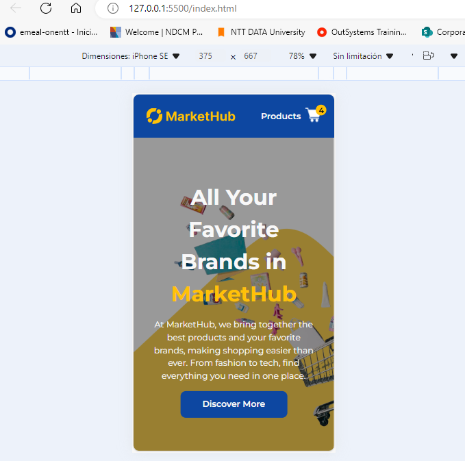
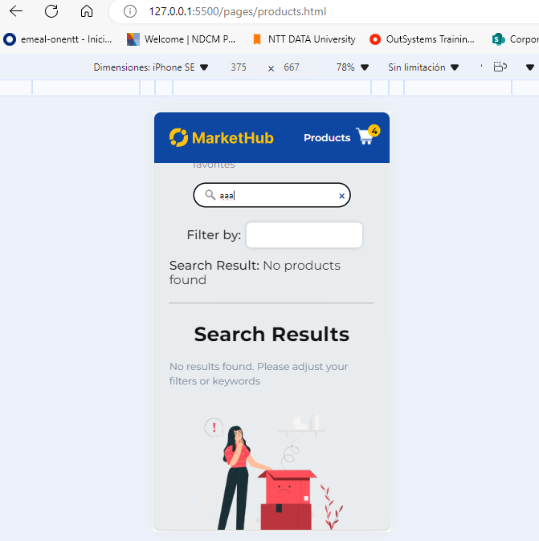

# Market Project

## Descripción

Este proyecto es un mini market place implementado con TypeScript. Los usuarios pueden buscar productos, filtrar por categoría y agregar productos a un carrito de compras.Además, se utilizó la API pública de DummyJSON para obtener los productos y categorías.
## Funcionalidades

- **Carga dinámica de productos**: Los productos se cargan desde [DummyJSON](https://dummyjson.com/docs/products#products-all) y se muestran en la página.
- **Búsqueda**: Los usuarios pueden buscar productos utilizando una caja de búsqueda. Los productos se filtran automáticamente a medida que el usuario escribe.
- **Filtrado por categorías**: Se puede filtrar la lista de productos según la categoría seleccionada por el usuario.
- **Contador de carrito**: El contador de productos en el carrito se incrementa cada vez que el usuario hace clic en "Add to Cart".
- **Sin uso de bibliotecas externas**: El proyecto utiliza solo Vanilla JavaScript y no permite el uso de `innerHTML` para insertar contenido dinámico.

## Migración a TypeScript

Este proyecto ha sido migrado de JavaScript a TypeScript, lo que permite:

- **Tipos Fuertes**: Se han definido interfaces y tipos para asegurar que los datos se manejen correctamente en toda la aplicación, evitando el uso de `any`.

- **Uso de Interfaces y Tipos**: Se han creado y utilizado interfaces para describir la forma de los datos de productos y categorías, lo que mejora la legibilidad y mantenibilidad del código.

- **Estructura de Archivos**: La lógica de negocio se ha separado de las definiciones de estructuras de datos, organizando el código en carpetas como `components`, `services`, y `mappers`.

- **Patrón de Mappers (Opcional)**: Se implementó un patrón de mappers para transformar las respuestas de los servicios en objetos de tipo `Product`, lo que facilita la manipulación de datos en la aplicación.

## Estructura del Proyecto
```
public/                      # Carpeta pública para archivos estáticos accesibles
src/                         # Carpeta fuente que contiene todos los archivos del proyecto
  ├── assets/               # Contiene todos los recursos estáticos del proyecto
  │   ├── design/           # Imágenes del diseño y de la implementación
  │   ├── fonts/            # Fuentes utilizadas
  │   ├── icons/            # Iconos
  │   ├── images/           # Imágenes 
  │   └── vectors/          # Gráficos vectoriales
  |
  ├── css/                  # Carpeta que incluye los archivos CSS para definir estilos
  │   └── style.css         # Archivo CSS principal para estilos del proyecto
  |
  ├── pages/                # Aquí se encuentran las páginas HTML del proyecto
  │   └── products.html     # Página que muestra la lista de productos
  |
  └── ts/                   # Carpeta que contiene los archivos TypeScript del proyecto
      ├── components.ts     # Maneja la creación y manipulación de elementos del DOM (Vista)
      ├── dataController.ts  # Contiene la lógica de datos y filtrado (Controlador)
      ├── index.ts          # Inicializa la aplicación y configura los listeners de eventos
      ├── interfaces.ts     # Define interfaces de TypeScript para modelos de datos
      └── mappers.ts        # Mapea las respuestas de la API a modelos del frontend
      └── services.ts       # Maneja llamadas a la API y gestiona el almacenamiento local (localStorage)
  |
  |──  main.ts           # Archivo principal que inicializa la aplicación
  └── vite-env.d.ts               # Definiciones de tipo para Vite
.gitignore                   # Archivos y directorios que Git debe ignorar
.prettierrc.json            # Configuración de Prettier
eslint.config.js            # Configuración de ESLint
index.html                  # Archivo HTML principal que contiene la estructura de la página
package.json                 # Archivo de configuración de npm con dependencias del proyecto

```

## Prototipo

Se desarrolló un prototipo de alta fidelidad utilizando la herramienta Figma. En este proceso, se implementaron conceptos de Atomic Design para estructurar los elementos de la página de manera eficiente y coherente.


**LINK:** [Ver prototipo de alta fidelidad en Figma](https://www.figma.com/proto/TMCcAkrrzbQA4suediBIO3/marketplace-webapp?node-id=2-14&node-type=frame&t=dXskumLnmc50er9v-0&scaling=min-zoom&content-scaling=fixed&page-id=2%3A2)

## Implementación del Proyecto

A continuación se muestran capturas de la implemenación:


