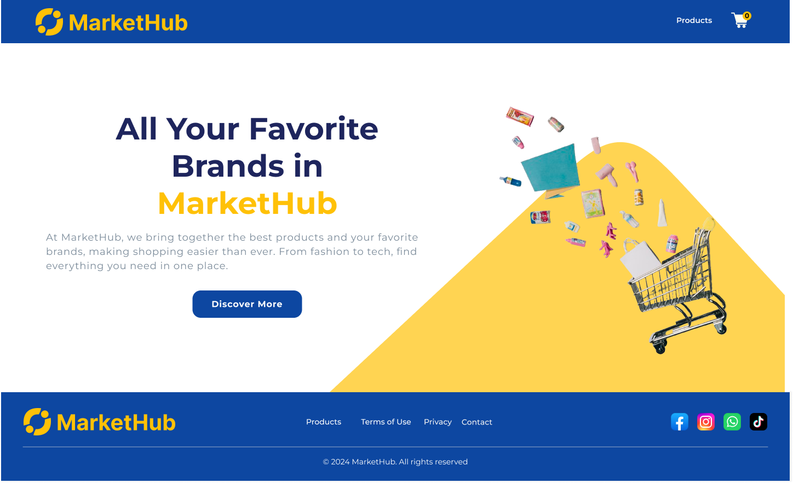
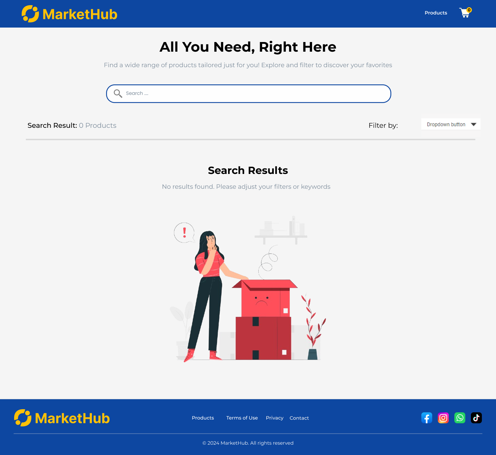
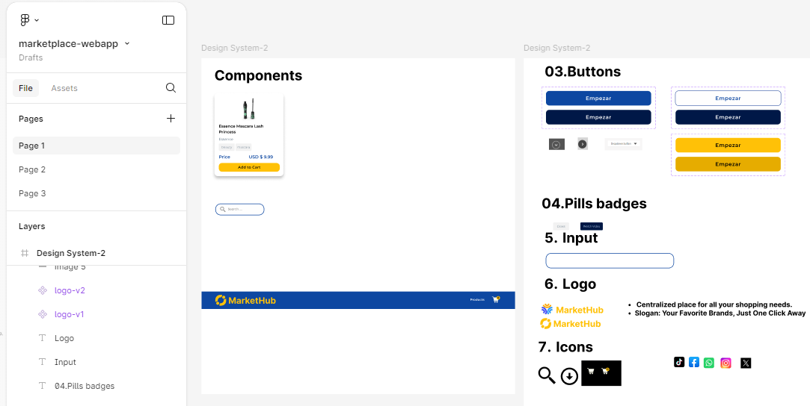

# Frontend 
En este proyecto, se creó un mini market place utilizando HTML5 y CSS3. 

# Objetivo 

El objetivo fue diseñar una interfaz atractiva y funcional, tomando como referencia el diseño compartido.

# Prototipo

Se desarrolló un prototipo de alta fidelidad utilizando la herramienta Figma. En este proceso, se implementaron conceptos de Atomic Design para estructurar los elementos de la página de manera eficiente y coherente.

**LINK:** [Ver prototipo de alta fidelidad en Figma](https://www.figma.com/proto/TMCcAkrrzbQA4suediBIO3/marketplace-webapp?node-id=2-14&node-type=frame&t=dXskumLnmc50er9v-0&scaling=min-zoom&content-scaling=fixed&page-id=2%3A2) 