# Market Project

## Descripción

Este proyecto es un mini marketplace desarrollado con **TypeScript**, **Vite** y **React**, que permite a los usuarios buscar productos, filtrar por categoría y agregar artículos al carrito. Utiliza la API pública de [DummyJSON](https://dummyjson.com/docs/products#products-all) para obtener datos y cuenta con autenticación mediante el servicio de login de DummyJSON, validando campos y mostrando mensajes de error personalizados. También incluye un enlace "Olvidé Contraseña" que abre una ventana modal para ingresar el correo electrónico y mostrar un mensaje de alerta.

## Funcionalidades

- **Carga Dinámica de Productos**: Los productos se cargan desde DummyJSON ([https://dummyjson.com/docs/products#products-all](https://dummyjson.com/docs/products#products-all)) y se muestran en la página.
- **Búsqueda**: Los usuarios pueden buscar productos utilizando una caja de búsqueda, filtrando automáticamente los resultados a medida que escriben.
- **Filtrado por Categorías**: Permite a los usuarios filtrar la lista de productos según la categoría seleccionada.
- **Contador de Carrito**: Incrementa el contador de productos en el carrito cada vez que se hace clic en "Agregar al Carrito".
- **Consumo de Servicios Web**: Utiliza la API Fetch para obtener datos, empleando `async` y `await` para manejar las solicitudes de manera eficiente.
- **Sin Uso de Bibliotecas Externas**: El proyecto está diseñado sin librerías de terceros, utilizando solo código nativo de JavaScript y TypeScript.
- **Configuraciones de Calidad de Código**: Se han añadido configuraciones de Prettier y ESLint para garantizar consistencia en el estilo y detectar errores, además de alias para optimizar las rutas de importación.
- **Página de Resumen del Carrito**: Se ha creado una nueva página llamada **carrito**, donde los usuarios pueden:
  - Visualizar la lista de productos agregados al carrito.
  - Eliminar, agregar o reducir la cantidad de elementos en el carrito.
  - Mostrar la imagen en miniatura del producto, nombre, precio, cantidad con controles de incremento y decremento, y un botón para eliminar.
  - Actualizar el total a pagar en la parte inferior de la tabla.
  - Los botones de incremento y decremento modificarán la cantidad especificada y actualizarán el ícono del carrito.
  - El botón eliminar eliminará el producto de la tabla y actualizará el contador del ícono del carrito.
  - El precio total se actualizará en base a la cantidad de productos en la tabla.
- **Autenticación de Usuario**: 
  - Implementación de la pantalla de login que permite a los usuarios iniciar sesión utilizando el servicio de autenticación ([https://dummyjson.com/docs/auth#auth-login](https://dummyjson.com/docs/auth#auth-login)).
  - Validación de los campos del formulario de login, con mensajes de error en caso de campos vacíos.
  - Control de errores de autenticación con mensajes personalizados para el usuario.
  - Uso de la biblioteca `react-hot-toast` para manejar notificaciones personalizadas en la aplicación. Esta librería permite mostrar mensajes emergentes de manera sencilla y efectiva, mejorando la experiencia del usuario al proporcionar alertas claras
  - Opción de "Olvidé Contraseña" que abre una modal para recuperación de contraseña, con validación de formato de correo electrónico.
- **Pruebas Unitarias**: Se han implementado pruebas unitarias en el proyecto utilizando `Jest` y `Testing Library`, cubriendo las principales funcionalidades y componentes.

## Estructura del Proyecto

La arquitectura del proyecto está organizada de la siguiente manera, garantizando una clara separación de responsabilidades:

```
/BC56-FRONTEND-REACT-NTTDATA
  ├── /public
  │   ├── vite.svg
  │   └── index.html
  ├── /src
  │   ├── /assets                  # Carpeta para recursos estáticos como imágenes y fuentes.
  │   │   ├── /design
  │   │   ├── /fonts
  │   │   ├── /icons
  │   │   ├── /images
  │   │   └── /vectors
  │   ├── /hooks               # Custom hooks de la aplicación
  │   │   ├── useDistricts.ts       # Hook para manejar el estado de distritos, cargando datos desde un archivo y brindando opciones para selección.
  │   │   ├── useForm.ts            # Hook para gestionar formularios, permitiendo el manejo de datos y validaciones de manera sencilla.
  │   │   └── usePagination.ts      # Hook para implementar paginación en listas, mejorando la experiencia de usuario en la visualización de datos.
  │   ├── /components       # Carpeta para los componentes que sigue la metodología de atomic design.
  │   │   ├── /atoms
  │   │   ├── /molecules
  │   │   └── /organisms
  │   ├── /contexts                # Manejo de contextos globales.
  │   │   └── CartContext.tsx
  |   |    ....
  │   ├── /data                    # Datos estáticos y definiciones.
  │   │   ├── districts-data.d.ts
  │   │   └── districts-data.js
  │   ├── /domain                  # Contiene la lógica de negocio y las definiciones de datos.
  │   │   ├── /constants
  │   │   └── /interfaces
  │   ├── /helpers                 # Funciones que incorporan lógica de negocio.
  │   │   └── filter-products.helpers.ts
  │   ├── /mappers                 # Carpeta para la lógica de mapeo de datos que facilita la manipulación de datos.
  │   │   ├── category.mapper.ts
  │   │   └── product.mapper.ts
  │   ├── /pages                   # Contiene las páginas.
  │   │   ├── Cart
  │   │   ├── Home
  │   │   ├── Login
  │   │   ├── Products
  │   │   └── ProductsRoutes.tsx
  │   ├── router/
  │   │   ├── PrivateRoutes.tsx // HOC que gestiona el acceso a rutas privadas
  │   │   └── PublicRoutes.tsx  // HOC que gestiona el acceso a rutas públicas
  │   ├── /services                # Maneja llamadas a la API y gestiona el almacenamiento local (localStorage).
  │   │   ├── auth.service.ts
  │   │   ├── category.service.ts
  │   │   ├── local-storage.service.ts
  │   │   └── product.service.ts
  │   ├── /store             # Estado de la aplicación utilizando reducers
  │   │   ├── /auth            # Estado de autenticación
  │   │   │   ├── authActions.ts 
  │   │   │   └── authReducer.ts 
  │   │   └── /cart            # Estado del carrito de compras
  │   │        ├── cartActions.ts 
  │   │        └── cartReducer.ts   
  │   ├── /utils                   # Funciones puras que son sin estado y no dependen de ningún estado externo.
  │   │   └── validation.utils.ts
  │   ├── App.tsx                  # Componente raíz.
  │   ├── index.css                # Estilos de entrada.
  │   ├── main.tsx                 # Archivo de entrada principal de la aplicación.
  │   ├── vite-env.d.ts            # Definiciones de tipos para Vite.
  │   └── react-env.d.ts           # Definiciones de tipos para React.
  ├── .gitignore                   # Archivo para ignorar archivos y carpetas en Git.
  ├── .prettierrc.json             # Configuración para Prettier.
  ├── README.md                    # Documentación del proyecto.
  ├── eslint.config.js             # Configuración para ESLint.
  ├── package.json                 # Archivo de configuración de dependencias del proyecto.
  ├── tsconfig.app.json            # Configuración de TypeScript para la aplicación.
  ├── tsconfig.json                # Configuración general de TypeScript.
  ├── tsconfig.node.json           # Configuración de TypeScript para el entorno Node.js.
  └── vite.config.ts               # Configuración de Vite para la aplicación.


```

**NOTAS :**

- Se ha mantenido la organización de carpetas según las funciones de cada una, facilitando la escalabilidad y mantenibilidad del proyecto.
- La carpeta helpers ahora incluye funciones que implementan la lógica de negocio, mientras que utils contiene funciones puras y stateless.
- La carpeta contexts se ha añadido para manejar el contexto global, específicamente para el carrito.
- Se ha implementado la carpeta router, que contiene los HOCs PrivateRoutes y PublicRoutes. Estos componentes gestionan el acceso a las rutas de la aplicación, garantizando que las rutas privadas solo sean accesibles para usuarios autenticados y permitiendo el acceso sin restricciones a las rutas públicas.
- Se ha optado por no utilizar localStorage ni sessionStorage directamente en los reducers cartReducer y authReducer, con el fin de preservar la pureza de las funciones. En su lugar, la gestión del almacenamiento local se ha trasladado al provider.

## Prototipo

Se desarrolló un prototipo de alta fidelidad utilizando la herramienta Figma en donde se ha agregado la página . En este proceso, se implementaron conceptos de Atomic Design para estructurar los elementos de la página de manera eficiente y coherente.


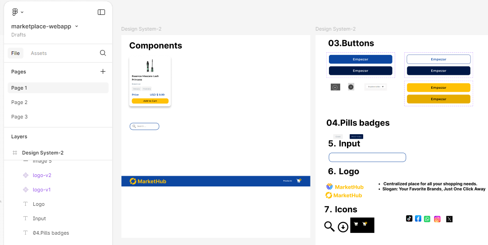


### Página Resumen

Se ha agregado una nueva página, la cual permite visualizar la lista de productos agregados al carrito, dándole la opción al usuario de poder eliminar, agregar o reducir productos. Por otro lado, la página tiene un formulario sobre la información de envío, para el proceso de compra.También, se tiene la página en el caso de que no se ha agregado ningún producto.

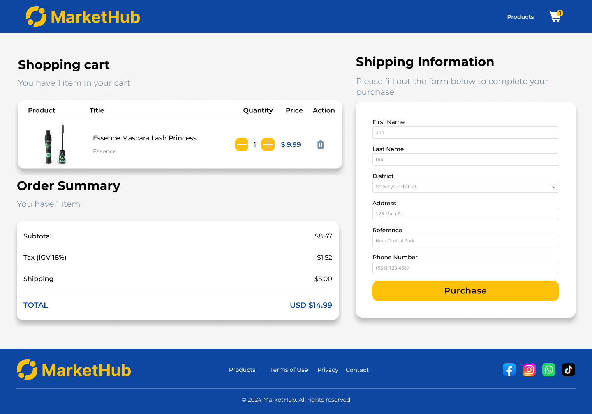
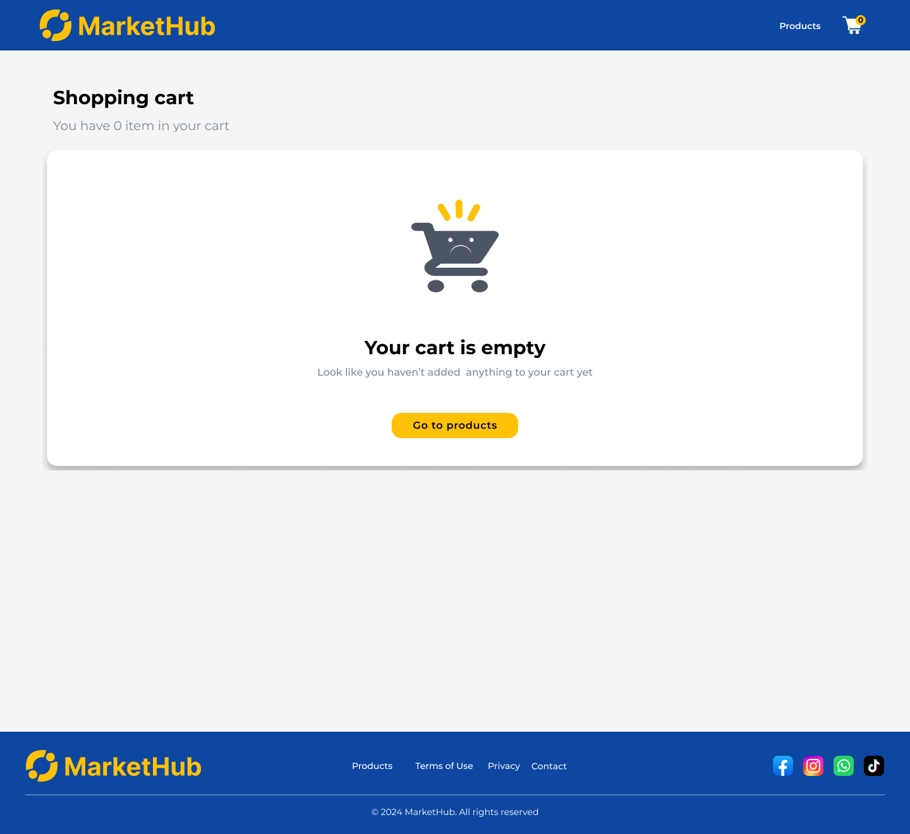

**LINK:** [Ver prototipo de alta fidelidad en Figma](https://www.figma.com/proto/TMCcAkrrzbQA4suediBIO3/marketplace-webapp?node-id=2-14&node-type=frame&t=dXskumLnmc50er9v-0&scaling=min-zoom&content-scaling=fixed&page-id=2%3A2)

## Implementación del Proyecto

En esta sección se muestra las imágenes de la implementación.

### Home

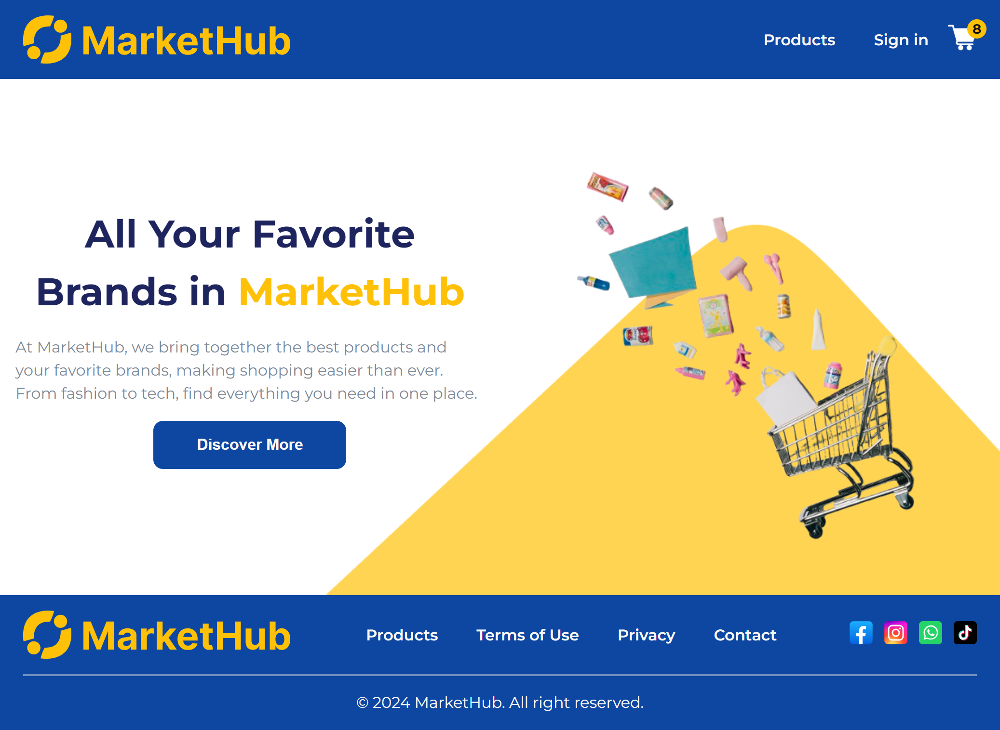

### Products

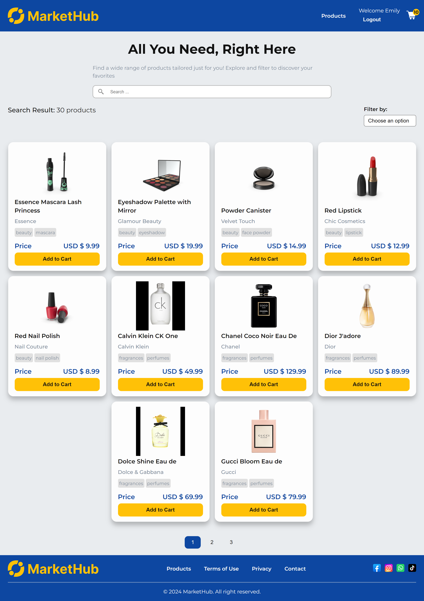

### Cart

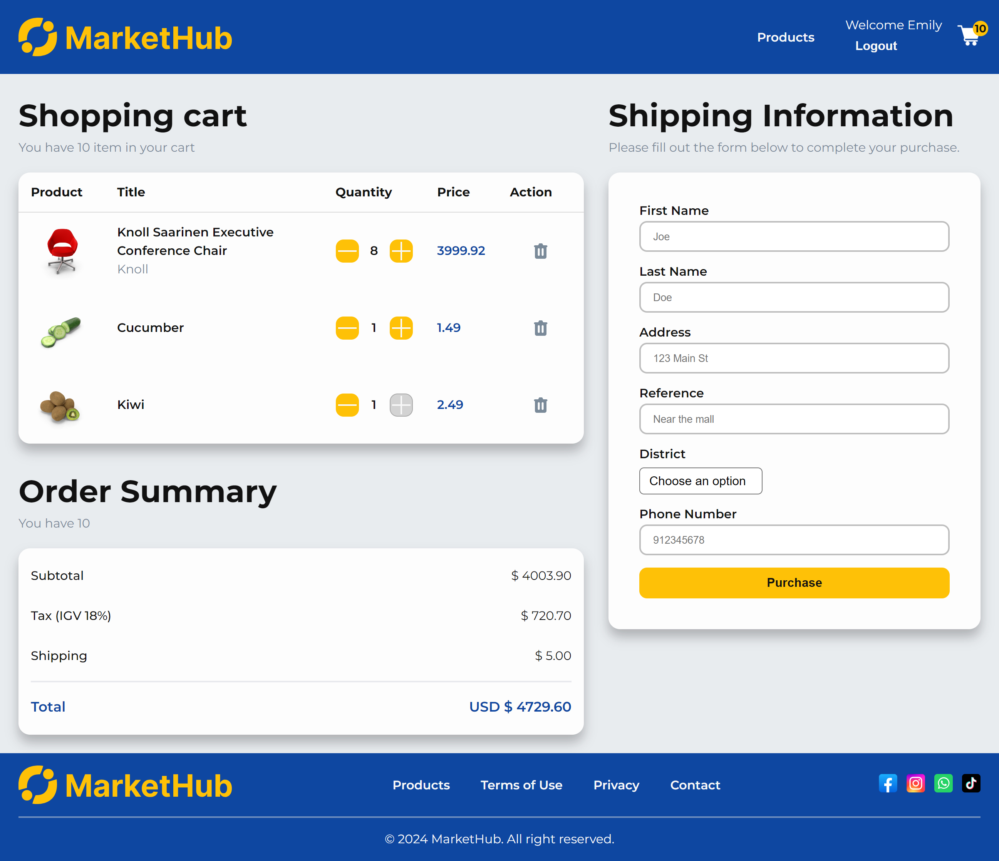

### Login

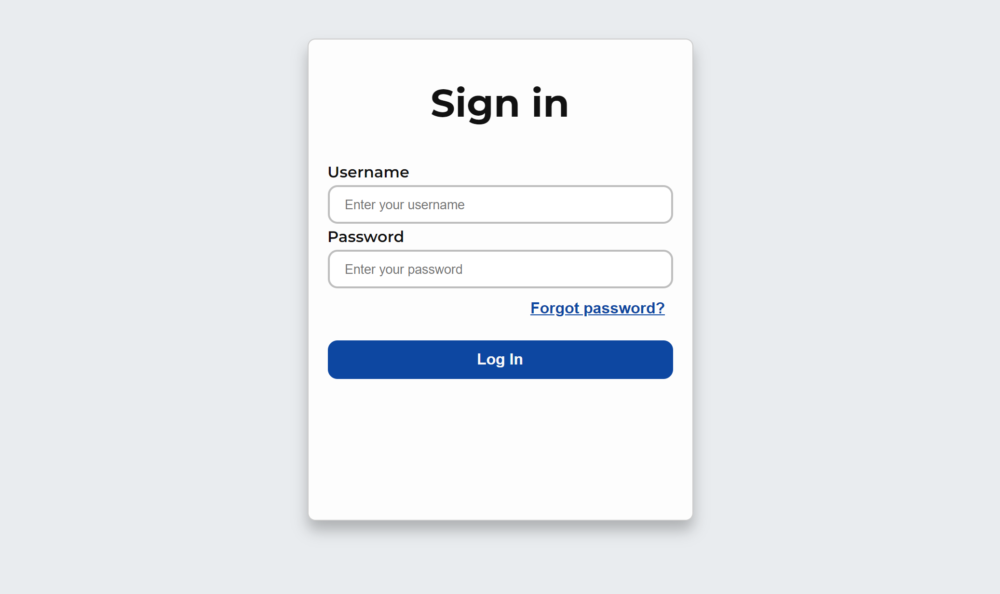
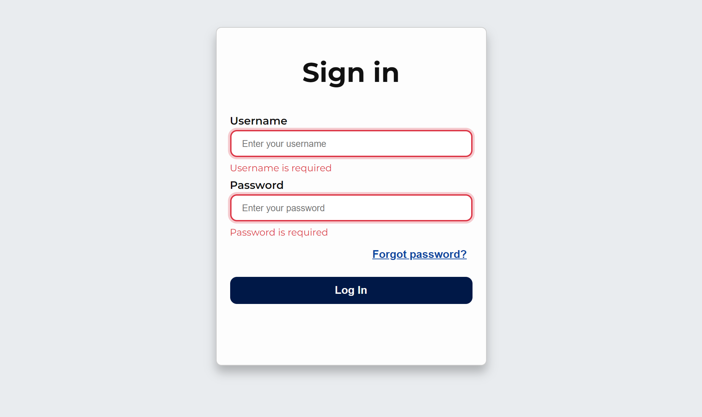
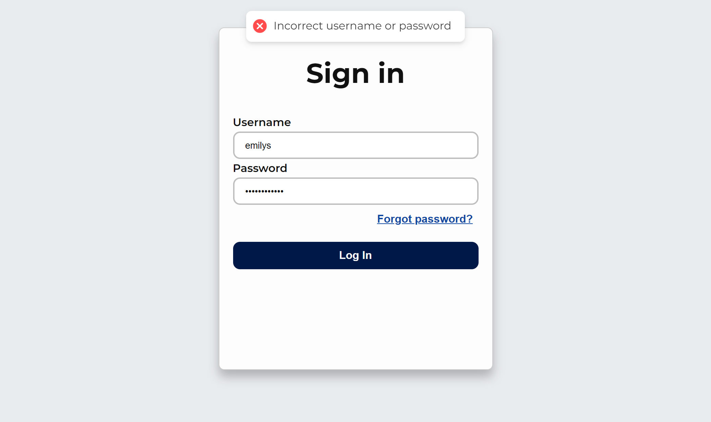

### Dialog

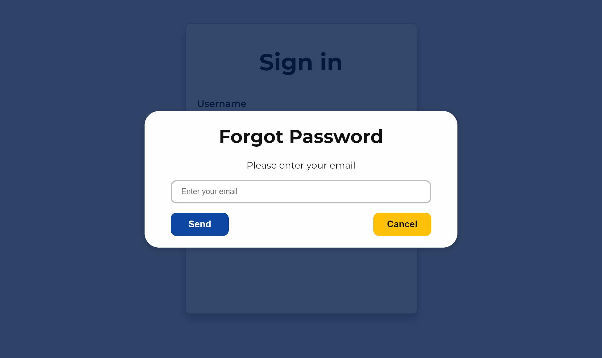

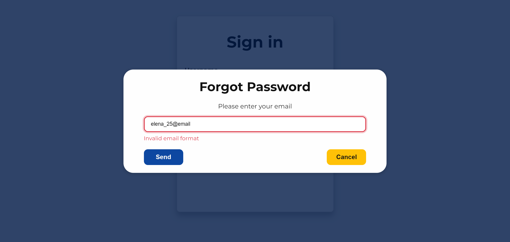
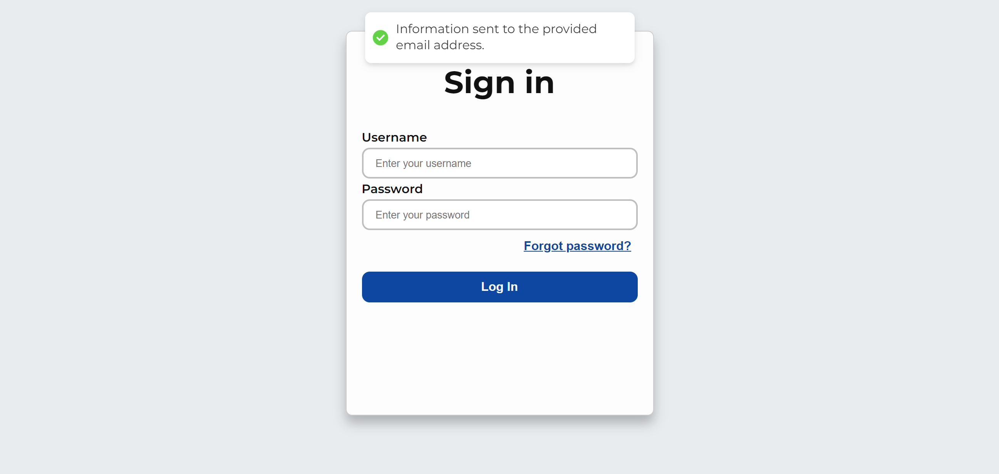
